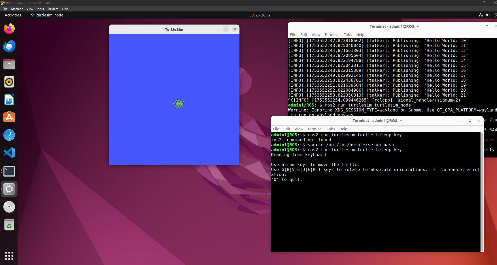

# Turtlesim ROS2 Manipulation

## Introduction
This project demonstrates how to manipulate the turtlesim package using ROS2 (Humble) on Ubuntu.
The goal is to launch a turtle simulation and control the turtle using keyboard commands.
All setup steps are explained clearly to help beginners start working with ROS2 and publishing commands to nodes.

---

## Requirements
- VirtualBox with Ubuntu (20.04+)
- ROS2 Humble installed
- turtlesim package
- Basic terminal access

---

## Ubuntu Commands & Explanations
### A. Install ROS2 Humble
```bash
sudo apt update && sudo apt upgrade

sudo apt install curl gnupg2 lsb-release

sudo curl -sSL https://raw.githubusercontent.com/ros/rosdistro/master/ros.key -o /usr/share/keyrings/ros-archive-keyring.gpg

echo "deb [arch=amd64 signed-by=/usr/share/keyrings/ros-archive-keyring.gpg] http://packages.ros.org/ros2/ubuntu $(lsb_release -cs) main" | sudo tee /etc/apt/sources.list.d/ros2.list > /dev/null

sudo apt update

sudo apt install ros-humble-desktop
```

### B. Source ROS2 environment
```bash
source /opt/ros/humble/setup.bash

To avoid repeating this every time:

echo "source /opt/ros/humble/setup.bash" >> ~/.bashrc
```

### C. Run the Turtlesim Node
```bash
ros2 run turtlesim turtlesim_node
```
This opens the blue simulation window with the turtle in it.

### D. Control the Turtle with Keyboard
In a second terminal:
```bash
ros2 run turtlesim turtle_teleop_key
```
Now use the arrow keys and G|B|V|C|D|E|R|T to rotate or move.

## Output
Below are example showing how the output:

### Example :


---

## What I Learned
- How to install and configure ROS2 Humble on Ubuntu.
- How nodes and packages work in ROS2.
- How to use turtlesim as a basic simulation tool.
- How to publish keyboard commands to control robot movement.
- How to manage multiple terminals and source environments properly.
